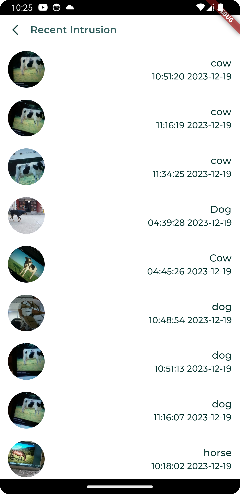

# Farm Watch
#### A real-time surveillance and protection of farms from animals

Crop Vandalism by animals is a major problem for farmers and can result in significant economic losses. This issue can occur when wildlife such as deer, rabbits, and squirrels damage crops in fields or when domesticated animals such as cattle and sheep break into fields and feed on crops. The outcome of this is reduced harvest output and substantial monetary damage for those in the farming industry. Considering the above scenario, we have developed a surveillance system “Farm Watch” for real-time detection of animals at farm fences can help farmers to keep track of their livestock.
   Farm Watch typically consists of cameras and sensors placed in the farm. The cameras are equipped with advanced image processing algorithms that can accurately identify different types of animals and trigger a noise deterrent system for that particular animal to repel the animal. Additionally, the system generates an alert that is sent to the farmer’s mobile device, allowing them to quickly respond and take appropriate action after seeing the live feed. By implementing these safeguards, farmers can rest assured that their crops are protected while also ensuring the safety and well-being of their livestock and the environment.

   

## Tech Stack
#### Frontend
- Frontend Framework: Flutter
- Frontend Language: Dart

#### Backend
- Database: Firestore Database
- Authentication: Firebase Authentication
- File Storage: Firebase Storage
- Middleware: Django
- Backend Language: Python

#### Hardware
- Respberry Pi
- Camera
- Buzzer

   

## Workflow

 

 - When a user logs in, an initial request is sent to Firebase to fetch previous intrusion data.
 - Simultaneously, an API is called to view the live field through a camera view.
 - On the other hand, when the deployed model on a Raspberry Pi detects animals entering the field view:
   * It triggers an API created with Django to send notifications to registered devices.
   * Another API is called to save data (image, time, and animal name) into the Firebase database.
   * Simultaneously, a buzzer is initiated to alert about the intrusion.

    

## Screenshots
- **Mobile Application**
  

  
  
   
    
   
  

  - **Hardware and Backend**
    

  
  
 
  

    

## How To Setup?
- #### Setup Application
  * Create new project on firebase
  * Add google-service.json file in App's /android/app folder
  * Add you backend ip in apps IP variable, as we will be going to host our backend in local network.
 
- #### Setup Backend
  * Add backend files in your respberry pi.
  * Create virtual enviroment and install requirements.
  * Run python server on you pi by executing - python manage.py runserver ip:port
  * Add traffic ip in allowed host
  * Also dont forget to add your firebase private key

 - #### Final Run
    * Add object detection folder in you respberry pi
    * Add backend ip in your object detection folders object-indent-3 file
    * Excute object-indent-3 file, it will start the camera for detection.
  
Review whole code, add required fields and files carefully.

 
